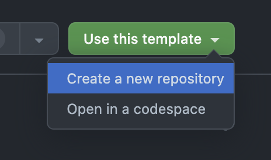
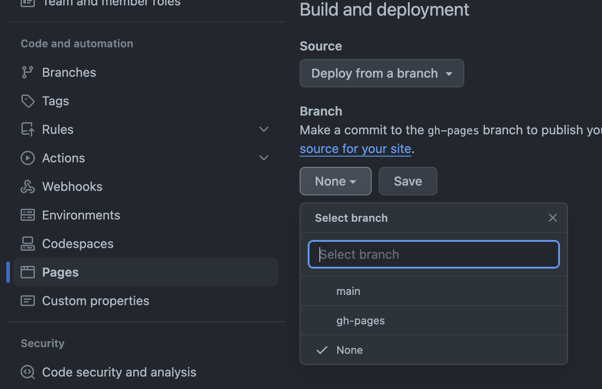
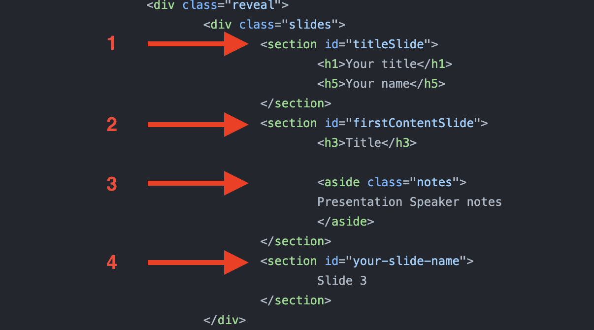

# reveal.js theme template for the Henry Royce Institute

This is the Henry Royce Institute branded theme for the [reveal.js](https://revealjs.com/) HTML presentation framework.

By using this template you can host and publish a presentation with the Royce branding on your github repository under \<USERNAME\>.github.io/\<REPOSITORY_NAME\>.

## How to use this template

### Create your repository

1. Navigate to the template icon within this page
2. Click on *Use this template*
3. Select *Create a new repository*
   - When creating the repository make sure to de-selecte 'Include all branches', only copy the `main` branch
   - You can review the repository naming tips in the section [Tips for naming your repository](https://github.com/royce-data/royce-reveal-presentation-template?tab=readme-ov-file#tips-for-naming-your-repository)
4. Edit [index.html](./presentation/index.html) in the [presentation](./presentation/) directory
   - You can also replace [index.html](./presentation/index.html) with [markdown_example.html](./example_resources/markdown_example.html) by placing it in the [presentation](./presentation/) directory and renaming it
5. Push your updates



### Publish your presentation

1. Navigate to *Settings* in your repository
2. Navigate to *Pages* in the left-hand side toolbar menu
3. Make sure that *Deploy from branch* is selected under *Source*
4. Select `gh-pages` under *Branch*
5. Click *Save*
6. Your website should take a few minutes to generate and will be live under \<USERNAME\>.github.io/\<REPOSITORY_NAME\>



### What is contained within the template

The files that will be published are within the [presentation](./presentation/) directory.

Within the directory you can find:

1. [index.html](./presentation/index.html), the file where you write the presentation
2. [reveal.js/](./presentation/reveal.js/) submodule directory, where the reveal.js framework codebase is hosted - we will endeavour to update this with the latest stable version within a few days of release
3. [royce_assets/](./presentation/royce_assets/) directory, where we house some images that make up the template
4. [styles/](./presentation/styles/) directory, where the `.scss` file, the `.css.map` auxiliary, and the compiled `.css` file are contained, the `.css` file is where the main theme is hosted
5. [modifiers/](/presentation/modifiers/) directory, which contains a JavaScript file for controlling the appearance of the title page of the presentation and the appearance according the location on the page

# UNDER CONSTRUCTION
## How to modify this template

### HTML

For a guide on how to use reveal.js to create HTML presentations, please consult the official guide for [reveal.js HTML](https://revealjs.com/markup/). For a template guide, we provide some inexhaustive instructions below.

#### Creating new slides

To create a new slide you can insert a section HTML element and start typing. The simplest way to do this is by copying the area marked with the number **4** on the image below, in [index.html](./presentation/index.html)

#### Adding speaker notes

To add speaker notes you can include an `<aside class="notes">` area before you close a slide section, as shown in the area marked with **3** on the image below



#### Danger Zone

If you want the template to behave as the one published on the template example https://royce-data.github.io/royce-reveal-presentation-template/index.html where the title slide has a different banner to the content slides then it's important that you do not tamper with the section id names marked 1 and 2 on the image above.


### Markdown

For Markdown, we include an example file in [example_resources](./example_resources/).  
If you want to write your presentation in Markdown, instead of HTML, you can replace [index.html](./presentation/index.html) with the [example file](./example_resources/markdown_example.html) and renaming it.

For the reveal.js Markdown guide, please review the official documentation for using [Markdown with reveal.js](https://revealjs.com/markdown/).

## Useful information

### How `gh-pages` is generated

When you push to the branch `main`, it will trigger an automatic process that copies the [presentation](./presentation/) directory to the branch `gh-pages`. You do not need to modify `gh-pages` as it is modified automatically and will host only what files are included in the [presentation](./presentation/) directory.  
Additionally, this automatic process will enable you to publish the presentation from the `gh-pages` branch.

If you want a homogenous theme without a title slide banner, you can remove the section id names shown in the above images

<details>

<summary>HTML</summary>

###### HTML
```
<section id="titleSlide">
...
...
...
</section>
<section id="firstContentSlide">
...
...
...
</section>
```
</details>

<details>

<summary>Markdown</summary>

###### Markdown

```
<!-- .slide: id="titleSlide" -->
...
...
...
---
<!-- .slide: id="firstContentSlide" -->
...
...
...
---
```
</details>

### Tips for naming your repository

1. Keep it short-ish
2. Be descriptive enough
3. ISO date format + conference is a good combination, e.g. '2024-02-28_nameofconference'
